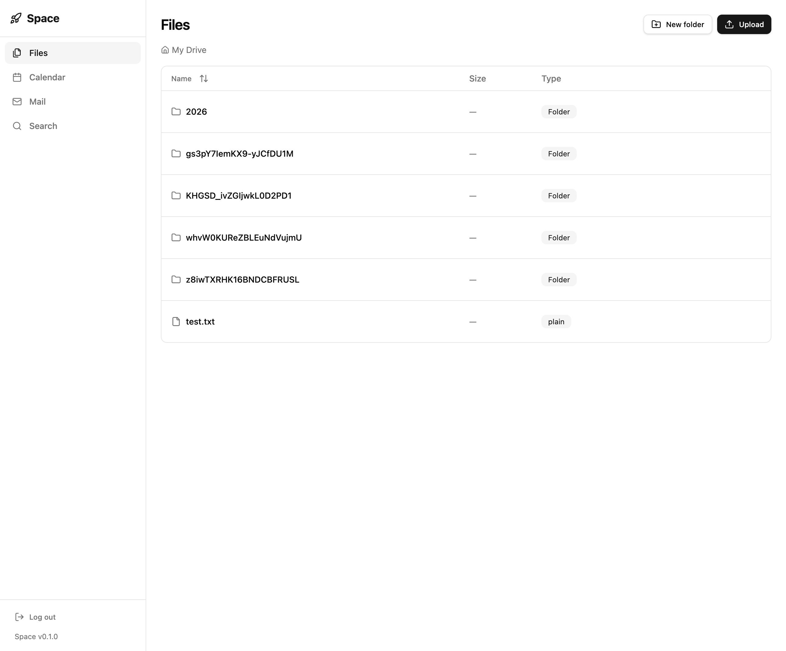

# Space — self-hosted open workspace

Unified workspace: files, emails & calendars.
Free. Open. Self-hosted. Yours.




## Tech Stack

- **Backend:** ElysiaJS (Bun) + Drizzle ORM (SQLite → PostgreSQL)
- **Frontend:** React + React Router + Vite + Tailwind CSS
- **Files:** S3-compatible storage
- **Email:** IMAP/SMTP (any provider)
- **Calendar:** CalDAV (Google, Nextcloud, Apple)

## Quick Start

### Docker (recommended)

```bash
# 1. Configure environment
cp .env.example .env
# Fill in .env (S3, IMAP/SMTP, CalDAV)

# 2. Start everything
docker compose up
```

Backend: http://localhost:3000 · Frontend: http://localhost:3001

```bash
# Logs
docker compose logs -f backend
docker compose logs -f frontend

# Shell inside container
docker compose exec backend sh
docker compose exec frontend sh

# Database studio
docker compose exec backend bun run db:studio

# Stop
docker compose down
```

### Local (without Docker)

```bash
# 1. Install dependencies
bun install
cd src/client && bun install && cd ../..

# 2. Configure environment
cp .env.example .env

# 3. Start backend (port 3000)
bun dev

# 4. Start frontend (port 3001, in a new terminal)
bun dev:client
```

Open http://localhost:3001 — login/register screen, then the workspace.

## Project Structure

```
src/
├── backend/              # ElysiaJS API (port 3000)
│   ├── plugins/          # Feature endpoints
│   │   ├── auth.ts           # JWT register/login
│   │   ├── calendar.ts       # CRUD + CalDAV sync
│   │   ├── files.ts          # S3 upload/download
│   │   ├── mail.ts           # IMAP/SMTP proxy
│   │   └── search.ts         # Unified search
│   ├── services/         # External integrations
│   │   ├── caldav.ts         # CalDAV client
│   │   ├── mail.ts           # IMAP/SMTP (imapflow)
│   │   └── s3.ts             # S3 client
│   ├── db/               # Drizzle ORM (bun:sqlite)
│   │   ├── schema.ts         # Tables definition
│   │   ├── index.ts          # DB connection
│   │   └── migrate.ts        # Auto-migration
│   └── index.ts          # App entry
├── client/               # React SPA (port 3001)
│   ├── components/       # UI components
│   │   ├── AppShell.tsx       # Layout + sidebar
│   │   ├── AuthGuard.tsx     # Login/Register
│   │   ├── CalendarView.tsx  # Calendar CRUD
│   │   ├── FilesView.tsx     # File manager
│   │   ├── MailView.tsx      # Email client
│   │   └── SearchView.tsx    # Unified search
│   ├── lib/
│   │   └── api.ts             # API client
│   ├── main.tsx           # Entry point
│   ├── styles.css         # Tailwind
│   └── index.html
└── shared/               # Shared types
    └── types.ts
```

## API

| Endpoint | Description |
|----------|-------------|
| `POST /api/auth/register` | Register |
| `POST /api/auth/login` | Login → JWT |
| `GET /api/calendar` | List events |
| `POST /api/calendar` | Create event |
| `POST /api/calendar/sync` | Sync with CalDAV |
| `GET /api/files` | List files |
| `POST /api/files` | Upload file |
| `POST /api/files/folder` | Create folder |
| `GET /api/files/:id/url` | Download URL |
| `GET /api/mail/folders` | List folders |
| `GET /api/mail/:folder` | Messages in folder |
| `POST /api/mail/send` | Send email |
| `GET /api/search?q=` | Unified search |

## Configuration

Root config file: `space.config.json`

```json
{
    "paths": {
        "dataDir": "/app/data",
        "filesDir": "/app/files"
    }
}
```

By default in Docker, `/app/files` maps to your project folder `./files` because the repository is mounted to `/app`.
You can override these paths via environment variables `DATA_DIR` and `FILES_DIR`.

File storage mode:
- local (default when S3 keys are not provided) — files API works directly from `FILES_DIR` (filesystem is source of truth)
- s3 (set `FILE_STORAGE=s3`) — files are uploaded to S3-compatible storage

In local mode, uploads are organized by date:
- first level: `YYYY` (year)
- second level: `MMDD` (month and day)
- file path: `YYYY/MMDD/<generated-id>.<ext>`

Notes for local mode:
- metadata for list/delete/download is read from filesystem in real time
- root for files API is the `FILES_DIR` folder itself (for example `./files`)
- DB table `files` is used only for S3 mode

| Service | Environment Variables |
|---------|----------------------|
| S3 | `S3_ENDPOINT`, `S3_BUCKET`, `S3_ACCESS_KEY`, `S3_SECRET_KEY` |
| IMAP | `IMAP_HOST`, `IMAP_PORT`, `IMAP_USER`, `IMAP_PASS` |
| SMTP | `SMTP_HOST`, `SMTP_PORT`, `SMTP_USER`, `SMTP_PASS` |
| CalDAV | `CALDAV_URL`, `CALDAV_USER`, `CALDAV_PASS` |

## TODO

- [ ] WebSocket for real-time notifications
- [ ] Rich text editor for email (Tiptap)
- [ ] Drag & drop for files
- [ ] Mobile responsive layout
- [ ] PostgreSQL for production
- [ ] File preview (PDF, images)
- [ ] Migrate to aws-sdk v3
